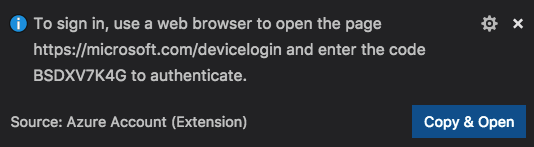

# Azure Support for Visual Studio Code

[Microsoft Azure](https://azure.microsoft.com/en-us/overview/what-is-azure/) support in Visual Studio Code is provided through a rich set of extensions that make it easy to discover and interact with the cloud services that power your applications. 

> If you do not have an Azure subscription, [sign up today](https://azure.microsoft.com/en-us/free/?b=16.48) for a free account and get **$200** in Azure Credits to try out any combination of Azure services.

## Azure Services

* Host your **web sites** using [App Service](https://marketplace.visualstudio.com/items?itemName=ms-azuretools.vscode-azureappservice), Azure's fully-managed Platform as a Service (PaaS) that let's you deploy and scale web, mobile, and API apps. The Azure App Service extension lets you quickly quickly create sites, deploy them, view logs, and even set environment variables (such as a Connection String), right from within VS Code. For more information, see the [App Service Walkthrough](https://code.visualstudio.com/tutorials/app-service-extension/getting-started).

* If you are using **MongoDB** you can seamlessly store and retrieve your data using [Cosmos DB](https://marketplace.visualstudio.com/items?itemName=ms-azuretools.vscode-cosmosdb), Azure's globally distributed database service. CosmosDB is "multi-model", meaning it supports a variety of common database APIs such as **MongoDB**, Graph, SQL, and Apache Cassandra. If your application already uses one of these database services, you can take advantage of CosmosDB's low latency and global scalability without changing a line of code. VS Code's Cosmos DB support lets you create and manage databases as well as write MongoDB command scripts in a _scrapbook_, with rich completions (IntelliSense) just as if you were writing JavaScript, Python, or C#.

* "[Serverless computing](https://en.wikipedia.org/wiki/Serverless_computing)" is done using [Functions](https://marketplace.visualstudio.com/items?itemName=ms-azuretools.vscode-azurefunctions), Azure's event driven, compute on demand service. You focus on writing the code and Azure will managed the infrastructure. The Functions support in VS Code lets you quickly browse, create, manage, deploy, and even **debug** functions locally. For more information, please see the [Functions Walkthrough](https://code.visualstudio.com/tutorials/functions-extension/getting-started).

* Have a **static site** you want to host? You can use [Azure Storage](https://marketplace.visualstudio.com/items?itemName=ms-azuretools.vscode-azurestorage) to host your site quickly and inexpensively. The Storage service also provides massive scale blob, file, and document storage with low latency and high throughput. VS Code's Storage support lets you deploy static sites, browse and edit Blob Containers, File Shares, Tables, and Queues. For more information, please see the [Static Site Walkthrough](https://code.visualstudio.com/tutorials/static-website/getting-started).

* Store your Docker images in _private_ Container Registries using the Azure Container Registry, and run them in the cloud using App Service. VS Code's support for [Docker](https://marketplace.visualstudio.com/items?itemName=PeterJausovec.vscode-docker) helps you author `Dockerfile` and `docker-compose` files with rich completions (IntelliSense), syntax highlighting and checking, and linting support. The Explorer view makes it easy to build, run, and manage your local and remote containers and images. For more information, please see the [Docker Walkthrough](https://code.visualstudio.com/tutorials/docker-extension/getting-started).

* The [Azure CLI 2.0](https://aka.ms/AzureCLI2) makes it easy to manage all of your Azure resources from a terminal. If you write CLI scripts, [VS Code's support](https://marketplace.visualstudio.com/items?itemName=ms-vscode.azurecli) provides syntax highlighting and completions (IntelliSense) for the CLI commands as well as your resources in Azure. You can execute one or more commands and even see the results in richly formatted `json`, document. For more information, please see the [Azure CLI Deployment Walkthrough](https://code.visualstudio.com/tutorials/nodejs-deployment/getting-started
  ).
  
* You can also automate management of Azure resources using [Azure Resource Manager](https://docs.microsoft.com/en-us/azure/azure-resource-manager/resource-group-overview) ("ARM") templates. VS Code's [support for ARM](https://marketplace.visualstudio.com/items?itemName=msazurermtools.azurerm-vscode-tools) makes it easy to author these `json` documents with rich editing and navigation experiences for deployment templates and template language expressions, including completions (IntelliSense) for TLE function names, parameter references, signature help, Go to Definition, Peek Definition, and Find All References (Shift+F12) as well as Errors and Warnings.

## Installation

By intalling support for Azure you will install all of the extensions listed above. Some of these extensions will also install the [Azure Account extension](https://marketplace.visualstudio.com/items?itemName=ms-vscode.azure-account) which provides a single Azure login and subscription filtering experience.

You can uninstall individual extensions or all by uninstalling this extension.

## Sign In

To sign in to your Azure Account, simply press `F1` and type in `Azure: Sign in` (or click on the `Sign in to Azure...` node in the Explorer).

From there, you will be prompted to open the browser and follow the device OAuth login flow. Note that the code will be automatically copied to the clipboad for you.

> Note: You may be prompted for access to your computer's secure credential storage service (e.g. Keychain Access on MacOS or Windows Credential Manager) so you don't need to sign in every time you start VS Code.

## Azure Explorer

Once signed in, you can access your Azure resources through the Azure Explorer. If you have not signed into Azure yet, or if you don't have an Azure subscription, you can click on the approriate links.

## Command Palette

You can access almost all Azure Services through the Command Palette. Simply press `F1`, then type in `Azure` to find the available commands.

## Contributing 

Got a suggestion for the Node Azure Extension Pack? Submit a new issue and a PR with an updated package.json and README.md and we'll take a look! 

Most contributions require you to agree to a Contributor License Agreement (CLA) declaring that you have the right to, and actually do, grant us the rights to use your contribution. For details, visit https://cla.microsoft.com.

When you submit a pull request, a CLA-bot will automatically determine whether you need to provide a CLA and decorate the PR appropriately (e.g., label, comment). Simply follow the instructions provided by the bot. You will only need to do this once across all repos using our CLA.

This project has adopted the [Microsoft Open Source Code of Conduct](https://opensource.microsoft.com/codeofconduct/). For more information see the [Code of Conduct FAQ](https://opensource.microsoft.com/codeofconduct/faq/) or contact [opencode@microsoft.com](mailto:opencode@microsoft.com) with any additional questions or comments.

## License

[MIT](LICENSE)
