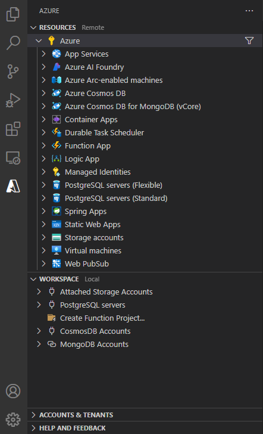
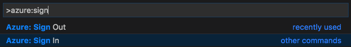
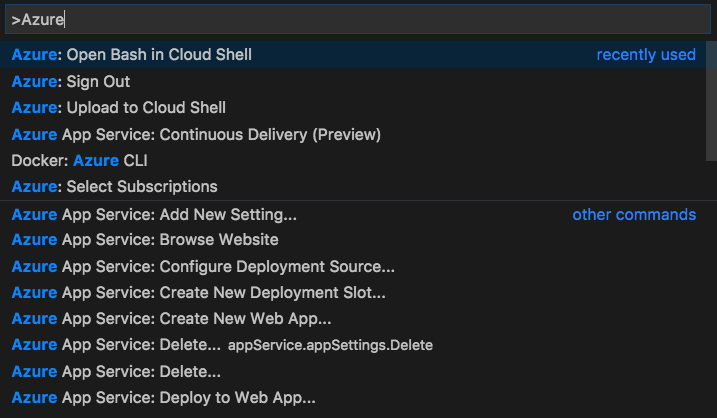

# Azure Tools for Visual Studio Code

[Microsoft Azure](https://azure.microsoft.com/en-us/overview/what-is-azure/) support for Visual Studio Code is provided through a rich set of extensions that make it easy to discover and interact with the cloud services that power your applications.

> If you do not have an Azure subscription, [sign up today](https://azure.microsoft.com/en-us/free/?b=16.48) for a free account. You'll get 12 months of popular free services, **\$200** in Azure Credits to try out any combination of Azure services, and access to 25+ always free services such as Azure Container Service, DevTest Labs, and Service Fabric.

## Azure Services

- Host your **Single Page and Serverless Web Apps (SPA & Jamstack)** using [Azure Static Web Apps](https://marketplace.visualstudio.com/items?itemName=ms-azuretools.vscode-azurestaticwebapps). Connect your GitHub repo to publish your apps directly to Azure and seamlessly add serverless backends powered by Azure Functions.

- Host your **full stack web sites and APIs** using [App Service](https://marketplace.visualstudio.com/items?itemName=ms-azuretools.vscode-azureappservice), Azure's fully-managed Platform as a Service (PaaS) that let's you deploy and scale web, mobile, and API apps. The Azure App Service extension lets you quickly create sites, deploy them, view logs, and even set environment variables (such as a Connection String), right from within VS Code. For more information, see the [App Service Walkthrough](https://code.visualstudio.com/tutorials/app-service-extension/getting-started).

- If you are using **MongoDB** you can seamlessly store and retrieve your data using [Databases](https://marketplace.visualstudio.com/items?itemName=ms-azuretools.vscode-cosmosdb), Azure's globally distributed database service. Cosmos DB is "multi-model", meaning it supports a variety of common database APIs such as **MongoDB**, Graph, SQL, and Apache Cassandra. If your application already uses one of these database services, you can take advantage of CosmosDB's low latency and global scalability without changing a line of code. VS Code's Cosmos DB support lets you create and manage databases as well as write MongoDB command scripts in a _scrapbook_, with rich completions (IntelliSense) just as if you were writing JavaScript, Python, or C#.

- "[Serverless computing](https://en.wikipedia.org/wiki/Serverless_computing)" is done using [Functions](https://marketplace.visualstudio.com/items?itemName=ms-azuretools.vscode-azurefunctions), Azure's event driven, compute on demand service. You focus on writing the code and Azure will managed the infrastructure. The Functions support in VS Code lets you quickly browse, create, manage, deploy, and even **debug** functions locally. For more information, please see the [Functions Walkthrough](https://code.visualstudio.com/tutorials/functions-extension/getting-started).

- Have a **static site** you want to host? You can use [Azure Static Web Apps](https://marketplace.visualstudio.com/items?itemName=ms-azuretools.vscode-azurestaticwebapps) to host your site quickly and inexpensively. Accelerate your app development with managed global availability for static content hosting and dynamic scale for integrated serverless APIs. Experience high productivity with a tailored local development experience, CI/CD workflows to build and deploy your app, and unified hosting and management in the cloud. For more information, please see the [Azure Static Web Apps Quickstart](https://learn.microsoft.com/en-us/azure/static-web-apps/getting-started).

- Manage your **Virtual Machines** in VS Code. Use the [Azure Virtual Machines](https://marketplace.visualstudio.com/items?itemName=ms-azuretools.vscode-azurevirtualmachines) extension to quickly create Virtual Machines with pre-configured SSH access. Use your VMs for deploying apps or connect to them directly using the [Remote-SSH](https://marketplace.visualstudio.com/items?itemName=ms-vscode-remote.remote-ssh) extension.

- View all of your **Azure Resources Groups** and quickly navigate to them in the Azure View with the [Azure Resource Groups](https://marketplace.visualstudio.com/items?itemName=ms-azuretools.vscode-azureresourcegroups) extension.

## Azure Developer CLI

Use the Azure [Developer CLI extension](https://marketplace.visualstudio.com/items?itemName=ms-azuretools.azure-dev) to create complete applications from templates then create the infrastructure and deploy the app in just a few simple commands.

## Installation

Intalling the Azure Tools installs all of the extensions listed above. Some of these extensions will also install the [Azure Account extension](https://marketplace.visualstudio.com/items?itemName=ms-vscode.azure-account) which provides a single Azure login and subscription filtering experience.

You can easily uninstall individual extensions if you are not interested in using them, without affecting other extensions provided by this pack. You can uninstall all of the extensions by uninstalling the Azure Tools extension.

## Sign In

To sign in to your Azure Account, simply press `F1` and type in `Azure: Sign in` (or click on the `Sign in to Azure...` node in the Explorer).

> Note: You may be prompted for access to your computer's secure credential storage service (e.g. Keychain Access on MacOS or Windows Credential Manager) so you don't need to sign in every time you start VS Code.

## Azure Explorer

Once signed in, you can access your Azure resources through the Azure Resource Explorer. If you have not signed into Azure yet, or if you don't have an Azure subscription, you can click on the approriate links. Use the Workspace explorer for commands related to your code such as deploying and creating new Azure-specific projects.

## Command Palette

You can access almost all Azure Services provided by these extensions through the Command Palette. Simply press `F1`, then type in `Azure` to find the available commands.

Docker commands can be found in the Command Palette in the same way, by pressing `F1` and then typing in `Docker`.

## Contributing

Got a suggestion for the Azure Tools extension? Submit a new issue and a PR with an updated `package.json` and `README.md` and we'll take a look!

Most contributions require you to agree to a Contributor License Agreement (CLA) declaring that you have the right to, and actually do, grant us the rights to use your contribution. For details, visit https://cla.microsoft.com.

When you submit a pull request, a CLA-bot will automatically determine whether you need to provide a CLA and decorate the PR appropriately (e.g., label, comment). Simply follow the instructions provided by the bot. You will only need to do this once across all repos using our CLA.

This project has adopted the [Microsoft Open Source Code of Conduct](https://opensource.microsoft.com/codeofconduct/). For more information see the [Code of Conduct FAQ](https://opensource.microsoft.com/codeofconduct/faq/) or contact [opencode@microsoft.com](mailto:opencode@microsoft.com) with any additional questions or comments.

## License

[MIT](LICENSE)
